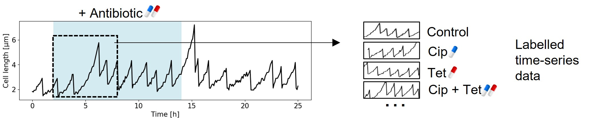

# timeseries-classification

This repository contains implementations of multiple models to benchmark embedding and classification of time-series data from microfluidic experiments.

The dataset contains time-series of single cell growth. The data comes from Broughton et al[[1]](#1). E. Coli cells were trapped in a microfluidic device called the Mother Machine and imaged every 5 to 10 minutes. An image analysis software was then used to extract cell features and track cells, generatimng single-cell time series data. The time series are multivariate, although the models are using univarate cell length data.

Some experiments were conducted under antibiotic exposure and the aim of the analysis is to detect antibiotic presence looking at the time series.

We previously used a Variational Recurrent Autoencoder to learn representations of those time series and performed classification on the embeddings using a Multi Layer Perceptron model[[2]](#2). This study aim to implement two foundational models ([[3]](#3),[[4]](#4)).

More information inside the code repo.

## References
<a id="1">[1]</a> Broughton, J., Fraisse, A. & El Karoui, M. Suppression of bacterial cell death underlies the antagonistic interaction between ciprofloxacin and tetracycline. Mol Syst Biol 22, 102–118 (2026). https://doi.org/10.1038/s44320-025-00162-w

<a id="2">[2]</a> Achille Fraisse, Diego A. Oyarzún, Meriem El Karoui. Representation learning of single-cell time-series with deep variational autoencoders. bioRxiv 2025.09.22.677729; doi: https://doi.org/10.1101/2025.09.22.677729

<a id="3">[3]</a> Mononito Goswami and Konrad Szafer and Arjun Choudhry and Yifu Cai and Shuo Li and Artur Dubrawski, MOMENT: A Family of Open Time-series Foundation Models, https://arxiv.org/abs/2402.03885

<a id="4">[4]</a> Abhimanyu Das, Weihao Kong, Rajat Sen, Yichen Zhou. A decoder-only foundation model for time-series forecasting. https://arxiv.org/html/2310.10688v2